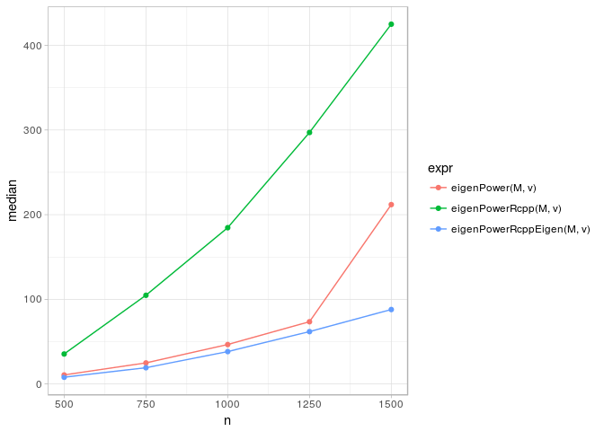
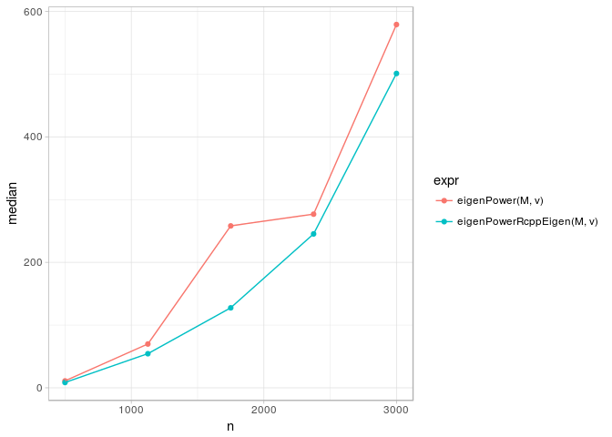

cpca
====

[](https://travis-ci.org/variani/cpca) [](https://cran.r-project.org/web/packages/cpca) [](http://cranlogs.r-pkg.org/badges/cpca) [](http://cranlogs.r-pkg.org/badges/grand-total/cpca) [](http://depsy.org/package/r/cpca)

About
-----

The `cpca` package approaches Common Principal Component Analysis (CPCA) by [the stepwise method](http://www.sciencedirect.com/science/article/pii/S016794731000112X) proposed by Trendafilov. In contrast to others, this method orders the components by the explained variance intrincically and alows computing a few first components. The later feature is beneficial in practice for high-dimenstional data.


The figure above shows an application of CPCA to the image compression problem. The original figure is the famous one from [http://lenna.org](lenna.org), and we estimated CPCA for three RBG data matrices *simultaneously* rather than doing SVD/PCA for each matrix separately.

The left panel on the Figure shows the CPCA-based compression using 5 components, the central panel - 25 components, and the right panel - all components. Script: [learn/03-pca/R/02-compress-image.R](https://github.com/variani/cpca/blob/master/learn/03-pca/R/02-compress-image.R).

The main function in the official release of `cpca` is `cpc`, while other function `cpca` is used in the `cpca` devepoment branch.

Demo
----

The `iris` demo shows an application of the `cpc` function to Fisher's iris data.

    library(cpca)
    demo(iris, package = "cpca")

[demo.html](http://htmlpreview.github.io/?https://raw.github.com/variani/cpca/master/inst/doc/demo.html) stored in the `inst/doc` directory presents both the code and the resulted output of the demo.

Note that the eigenvectors obtained by the `cpc` function are exactly the same as reported in Trendafilov, 2010, Section 5, Example 2. That means that Trendafilov's method (which is default in the `cpc` function) is implemnted accurately (at least for iris data).

Installation
------------

The following commands install the development (master branch) version from Github.

    library(devtools)
    install_github("cpca", user = "variani")

Citation
--------

Currently, we don't have a specific publication for the `cpca` package. Please see the current citation information by the following command in R.

    library(cpca)
    citation(package = "cpca")

The citation information is stored in the `CITATION` file in the `inst` directory and can be updated in the future.

-   CITATION - cpca package citation information

References
----------

List of publications, where the `cpca` package was used:

-   Kanaan-Izquierdo, S., Ziyatdinov, A., Massanet, R., & Perera, A. (2012). Multiview approach to spectral clustering. In 2012 Annual International Conference of the IEEE Engineering in Medicine and Biology Society (pp. 1254–1257). IEEE. <doi:10.1109/EMBC.2012.6346165>
-   Fernandez-Albert, F. et al. (to be appeared). A Common Variance Compensation method for intensity drift removal in LC / MS metabolomics.

Mathematical algorithms implemented in the `cpca` package:

-   Trendafilov, N. T. (2010). Stepwise estimation of common principal components. Computational Statistics & Data Analysis, 54(12), 3446–3457. <doi:10.1016/j.csda.2010.03.010>

License
-------

The cpca package is licensed under the GPLv3. See COPYING file in the `inst` directory for additional details.

-   COPYING - cpca package license (GPLv3)

Benchmarks
----------

### Speed up of eigenPower by using Rcpp & RcppEigen

``` r
f <- system.file("benchmarks/bench-01-eigenPowerRcpp.R", package = "cpca")
source(f)
print(p)
```



The same figure from a previous version of `cpca`, where both RcppEigen and RcppArmadillo version of `eigenPower` function were implemented.


### Speed up of eigenPower by using RcppEigen on larger matrices

``` r
f <- system.file("benchmarks/bench-02-eigenPower.R", package = "cpca")
source(f)
print(p)
```


