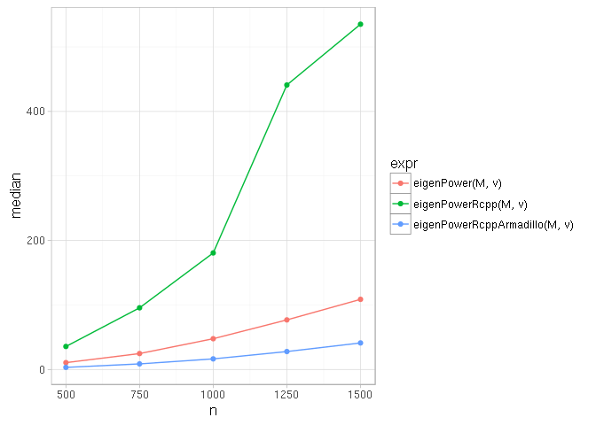

## Benchmarks

### Speed up of eigenPower by using Rcpp & RcppEigen

```{r becnh1, echo = T, results = "hide"}
f <- system.file("benchmarks/bench-01-eigenPowerRcpp.R", package = "cpca")
source(f)
print(p)
```

The same figure from a previous version of `cpca`, where both RcppEigen and RcppArmadillo
version of `eigenPower` function were implemented.



### Speed up of eigenPower by using RcppEigen on larger matrices

```{r becnh2, echo = T, results = "hide"}
f <- system.file("benchmarks/bench-02-eigenPower.R", package = "cpca")
source(f)
print(p)
```
