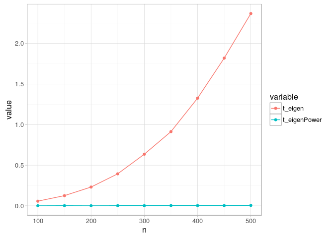
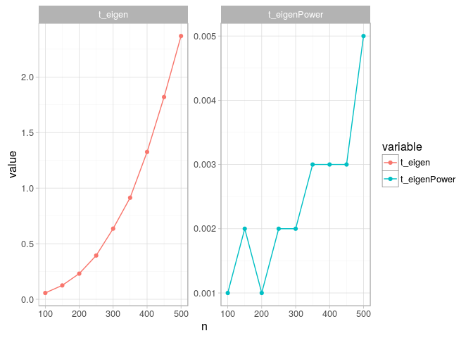
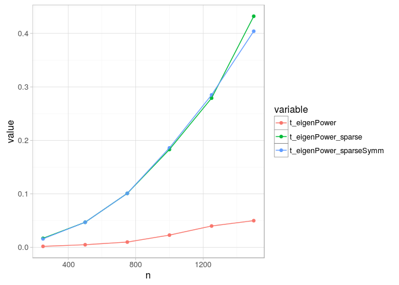

# Power algorithm for EVD
Andrey Ziyatdinov  
`r Sys.Date()`  


# About 

[wiki](https://en.wikipedia.org/wiki/Power_iteration): 

>In mathematics, the power iteration is an eigenvalue algorithm: given a matrix A, the algorithm will produce a number $\lambda$ (the eigenvalue) and a nonzero vector v (the eigenvector), such that $A v = \lambda v$. The algorithm is also known as the Von Mises iteration.

>The power iteration is a very simple algorithm. It does not compute a matrix decomposition, and hence it can be used when A is a very large sparse matrix. However, it will find only one eigenvalue (the one with the greatest absolute value) and it may converge only slowly.


## References

* [Blog post](http://blogs.sas.com/content/iml/2012/05/09/the-power-method.html) with SAS code (inspired this post)

# `eigenPower` function


```r
eigenPower <- function(A, v0, tol = 1e-6, maxit = 1e3, 
  sparse = FALSE, sparseSymm = FALSE, 
  verbose = 0)
{
  timing <- list()
  timing$args <- proc.time()
  
  ### arguments
  stopifnot(!missing(A))
  
  if(missing(v0)) {
    v0 <- runif(ncol(A))
  }
  
  ### convert into sparse matrices
  if(any(sparse, sparseSymm)) {
    stopifnot(require(Matrix))
    
    if(sparse) {
      A <- Matrix(A, sparse = T)
    }
    
    if(sparseSymm) {
      A <- Matrix(A, sparse = T)
      A <- as(A, "symmetricMatrix")
    }
  }
  
  ### vars
  sparseMatrix <- FALSE
  cl <- attr(class(A), "package")
  if(!is.null(cl)) {
    if(cl == "Matrix") {
      sparseMatrix <- TRUE
    }
  }
  
  ### preparation before looping
  timing$algo <- proc.time()
  
  v0 <- as.numeric(v0)
  
  v <- v0
  v <- v / sqrt(v %*% v)

  ### loop
  lambda0 <- 0
  for(it in 1:maxit) {
    if(verbose > 1) {
      cat(" * it:", it, "/", maxit, "\n")
    }

    b <- tcrossprod(A, t(v)) # A %*% v
    v <- b / sqrt(as.numeric(crossprod(b)))
    lambda <- as.numeric(crossprod(v, b)) # t(v) %*% b
           
    delta <- abs((lambda - lambda0) / lambda)
    if(delta < tol) {
      break
    }
    
    lambda0 <- lambda
  }
  
  ### post-process
  converged <- (it < maxit)
  
  ### output
  timing$return <- proc.time()
  
  timing$targs <- timing$algo[["elapsed"]] - timing$args[["elapsed"]]
  timing$talgo <- timing$return[["elapsed"]] - timing$algo[["elapsed"]]
  
  out <- list(v0 = v0, tol = tol, maxit = maxit,
    it = it, delta = delta, converged = converged, 
    sparseMatrix = sparseMatrix,
    timing = timing,
    lambda = lambda, v = v)
  
  return(out)
}
```

## Test on a small example

The given example is borrowed from [here](http://blogs.sas.com/content/iml/2012/05/09/the-power-method.html).


```r
A <- matrix(c(-261, 209, -49, 
  -530, 422, -98,
  -800, 631, -144),
  ncol = 3, nrow = 3, byrow = TRUE)
  
v0 <- c(1, 2, 3)

out <- eigenPower(A, v0, maxit = 40, verbose = 2)
```

```
 * it: 1 / 40 
 * it: 2 / 40 
```

```r
out[c("lambda", "v")]
```

```
$lambda
[1] 10

$v
          [,1]
[1,] 0.2672612
[2,] 0.5345225
[3,] 0.8017837
```


```r
out <- eigenPower(A, v0, maxit = 40, verbose = 2, sparse = TRUE)
```

```
 * it: 1 / 40 
 * it: 2 / 40 
```

```r
out[c("lambda", "v")]
```

```
$lambda
[1] 10

$v
3 x 1 Matrix of class "dgeMatrix"
          [,1]
[1,] 0.2672612
[2,] 0.5345225
[3,] 0.8017837
```


```r
eigen(A)
```

```
$values
[1] 10  4  3

$vectors
           [,1]      [,2]      [,3]
[1,] -0.2672612 0.4613527 0.2592593
[2,] -0.5345225 0.7097734 0.5185185
[3,] -0.8017837 0.5323301 0.8148148
```

## Test on CPU time


```r
n <- seq(100, 500, by = 50)

out <- lapply(n, function(ni) {
  M <-  matrix(runif(ni * ni), ni, ni)

  lt <- lower.tri(M)
  ut <- upper.tri(M)

  M[lt] <- M[ut]
  
  list(n = ni,
    t.eigen = system.time(eigen(M))[["elapsed"]],
    t.eigenPower = system.time(eigenPower(M))[["elapsed"]])
})  
```


```r
df <- ldply(out, function(x) data.frame(n = x$n, t_eigen = x$t.eigen, 
  t_eigenPower = x$t.eigenPower))

pf <- melt(df, id.vars = "n")

ggplot(pf, aes(n, value, color = variable)) + geom_point() + geom_line()
```

 

```r
ggplot(pf, aes(n, value, color = variable)) + geom_point() + geom_line() + facet_wrap(~ variable, scales = "free_y")
```

 

## Test on CPU time (sparse matrices)


```r
n <- seq(250, 1500, by = 250)

out <- lapply(n, function(ni) {
  M <-  matrix(runif(ni * ni), ni, ni)

  ind <- sample(seq(1, ni * ni), size = 0.85 * ni * ni, replace = F)
  M[ind] <- 0

  lt <- lower.tri(M)
  M[lower.tri(M)] = t(M)[lower.tri(M)]

  M1 <- Matrix(M, sparse = T)

  M2 <- Matrix(M, sparse = T)
  M2 <- as(M2, "symmetricMatrix")
    
  list(n = ni,
    t.eigenPower = system.time(eigenPower(M))[["elapsed"]],
    t.eigenPower.sparse = system.time(eigenPower(M, sparse = T))[["elapsed"]],
    t.eigenPower.sparseSymm = system.time(eigenPower(M, sparseSymm = T))[["elapsed"]])
})  
```


```r
df <- ldply(out, function(x) data.frame(n = x$n,
  t_eigenPower = x$t.eigenPower, 
  t_eigenPower_sparse = x$t.eigenPower.sparse,
  t_eigenPower_sparseSymm = x$t.eigenPower.sparseSymm))

pf <- melt(df, id.vars = "n")

ggplot(pf, aes(n, value, color = variable)) + geom_point() + geom_line()
```

 

```r
ggplot(subset(pf, variable != "t_eigenPower"), aes(n, value, color = variable)) + geom_point() + geom_line()
```

 

## Test on CPU time (sparse matrices) #2


```r
n <- seq(250, 1500, by = 250)

out <- lapply(n, function(ni) {
  M <-  matrix(runif(ni * ni), ni, ni)

  ind <- sample(seq(1, ni * ni), size = 0.85 * ni * ni, replace = F)
  M[ind] <- 0

  lt <- lower.tri(M)
  M[lower.tri(M)] = t(M)[lower.tri(M)]

  
  out.eigenPower <- eigenPower(M)  
  out.eigenPower.sparse <- eigenPower(M, sparse = T)  
    
  list(n = ni,
    targs.eigenPower = out.eigenPower$timing$targs,
    talgo.eigenPower = out.eigenPower$timing$talgo,
    targs.eigenPower.sparse = out.eigenPower.sparse$timing$targs,
    talgo.eigenPower.sparse = out.eigenPower.sparse$timing$talgo    
  )
})  
```


```r
df <- ldply(out, function(x) data.frame(n = x$n,
  targs_eigenPower = x$targs.eigenPower, 
  talgo_eigenPower = x$talgo.eigenPower, 
  targs_eigenPower_sparse = x$targs.eigenPower.sparse, 
  talgo_eigenPower_sparse = x$talgo.eigenPower.sparse))  
  
pf <- melt(df, id.vars = "n")
pf <- mutate(pf, t = substr(variable, 1, 5))

ggplot(pf, aes(n, value, color = variable)) + geom_point() + geom_line()
```

 

```r
ggplot(subset(pf, t == "targs"), aes(n, value, color = variable)) + geom_point() + geom_line()
```

 

```r
ggplot(subset(pf, t == "talgo"), aes(n, value, color = variable)) + geom_point() + geom_line()
```

 
