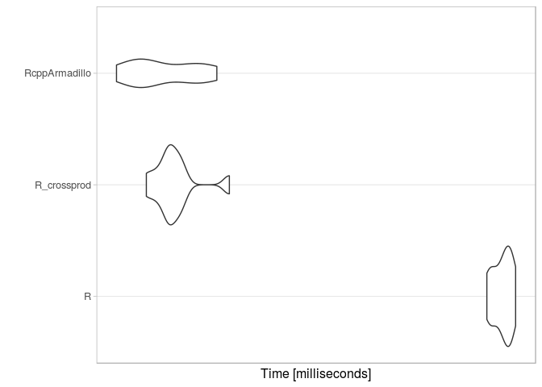
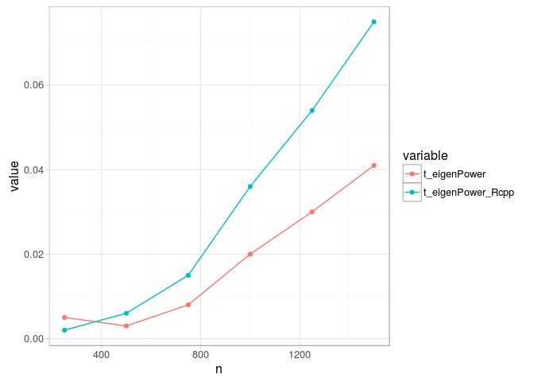

# Matrix multiplication using Rcpp
Andrey Ziyatdinov  
`r Sys.Date()`  


# About 

## References

* [This question](http://stackoverflow.com/questions/24933290/elementwise-matrix-multiplication-r-versus-rcpp-how-to-speed-this-code-up) that inspired this post.

# Include


```r
library(Rcpp)
library(RcppArmadillo)

library(Matrix)

library(microbenchmark)
```

# Xy operation


```r
sourceCpp(code ='
  #include <RcppArmadillo.h>
  // [[Rcpp::depends(RcppArmadillo)]]

  using namespace Rcpp;
  using namespace arma;

  // [[Rcpp::export]]
  arma::vec A_matvec_mult(const arma::mat & X, const arma::vec & y){
    arma::vec out = X * y;  
    return out;
  }'
) 
```

# Testing on a small example


```r
A <- matrix(c(-261, 209, -49, 
  -530, 422, -98,
  -800, 631, -144),
  ncol = 3, nrow = 3, byrow = TRUE)
  
v <- c(1, 2, 3)
```


```r
A %*% v
```

```
     [,1]
[1,]   10
[2,]   20
[3,]   30
```

```r
A_matvec_mult(A, v)
```

```
     [,1]
[1,]   10
[2,]   20
[3,]   30
```

## microbenchmark


```r
n <- 50000
k <- 50
X <- matrix(rnorm(n*k), nrow = k)
e <- rnorm(n)

out <- microbenchmark(R = X %*% e, 
  R_crossprod = tcrossprod(X, t(e)),  
  RcppArmadillo = A_matvec_mult(X, e),
  times = 10)

autoplot(out)  
```

 

# Power method


```r
sourceCpp("source/eigenPower_Rcpp.cpp") 
```


```r
eigenPower_wrapper <- function(A, v0, ...)
{
  stopifnot(!missing(A))
  if(missing(v0)) {
    v0 <- runif(ncol(A))
  }
  
  eigenPower_Rcpp(A, v0, ...)
}
```


```r
eigenPower_wrapper_Parallel <- function(A, v0, ...)
{
  stopifnot(!missing(A))
  if(missing(v0)) {
    v0 <- runif(ncol(A))
  }
  
  eigenPower_Rcpp_Parallel(A, v0, ...)
}
```

## Big examples


```r
n <- seq(250, 1500, by = 250)

out <- lapply(n, function(ni) {
  set.seed(1)
  M <-  matrix(runif(ni * ni), ni, ni)
  
  lt <- lower.tri(M)
  M[lt] <- t(M)[lt]
  
  list(n = ni,
    t.eigenPower = system.time(eigenPower(M))[["elapsed"]],
    t.eigenPower_Rcpp = system.time(eigenPower_wrapper(M))[["elapsed"]]
  )
})  
```


```r
df <- ldply(out, function(x) data.frame(n = x$n,
  t_eigenPower = x$t.eigenPower,
  t_eigenPower_Rcpp = x$t.eigenPower_Rcpp))
  
pf <- melt(df, id.vars = "n")

ggplot(pf, aes(n, value, color = variable)) + geom_point() + geom_line()
```

 

## Direct call of eigenPower_Rcpp


```r
n <- seq(250, 1500, by = 250)

out <- lapply(n, function(ni) {
  set.seed(1)
  M <-  matrix(runif(ni * ni), ni, ni)
  
  lt <- lower.tri(M)
  M[lt] <- t(M)[lt]
  
  list(n = ni,
    t.eigenPower = system.time(eigenPower(M))[["elapsed"]],
    t.eigenPower_Rcpp_wrapper = system.time(eigenPower_wrapper(M))[["elapsed"]],    
    t.eigenPower_Rcpp = system.time(eigenPower_Rcpp(M, runif(ncol(M))))[["elapsed"]]
  )
})  
```


```r
df <- ldply(out, function(x) data.frame(n = x$n,
  t_eigenPower = x$t.eigenPower,
  t_eigenPower_Rcpp_wrapper = x$t.eigenPower_Rcpp_wrapper,
  t_eigenPower_Rcpp = x$t.eigenPower_Rcpp))
  
pf <- melt(df, id.vars = "n")

ggplot(pf, aes(n, value, color = variable)) + geom_point() + geom_line()
```

 

## microbenchmark

### Random matrix 


```r
n <- 1000
M <- matrix(runif(n * n), n, n)

out <- microbenchmark(eigenPower = eigenPower(M), 
  eigenPower_Rcpp_wrapper = eigenPower_wrapper(M),
  eigenPower_Rcpp_Parallel_wrapper = eigenPower_wrapper_Parallel(M),    
  times = 10)

autoplot(out)  
```

 

### 0.75 Sparse symmetric matrix


```r
n <- 1000
#M <- matrix(runif(n * n), n, n)
M <- as.matrix(rsparsematrix(n, n, 0.75, symmetric = TRUE))

out <- microbenchmark(eigenPower = eigenPower(M), 
  eigenPower_Rcpp_wrapper = eigenPower_wrapper(M),
  eigenPower_Rcpp_Parallel_wrapper = eigenPower_wrapper_Parallel(M),    
  times = 10)

autoplot(out)  
```

 
